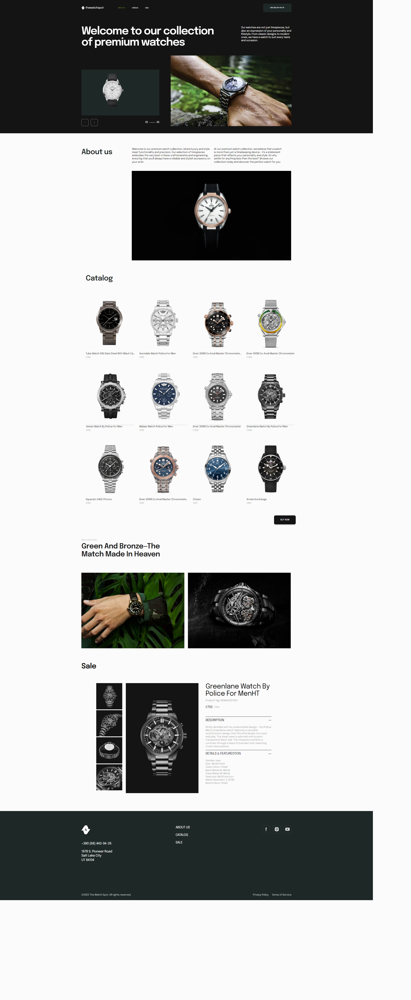

## Web Studio Project

This project was developed collaboratively by team siks. the team creatied a simple and elegant web studio website project using HTML, CSS, and JavaScript.

Project Overview:

## Team Siks 
Bill Mico Malazarte - Team Leader
Julius King De Guzman 
Cedric Abcede
Maria Victoria Villamor
Jovelyn Molos
Richard A. Huelar

Technologies Used: HTML, CSS, JavaScript
Project Description:
The WatchSpot is a responsive website designed to showcase a collection of premium watches. It features a clean and intuitive user interface, highlighting the watches' details and specifications. The website includes:

Pages for various watch categories and collections.
Individual product pages with detailed descriptions and images.
Contact form for customer inquiries.
Designed with a focus on simplicity and user experience.
Team Contributions:

Each team member contributed to different aspects of the project, including design, front-end development, and content creation.
Regular collaboration and communication ensured the project met its objectives and deadlines.
This project demonstrates our proficiency in front-end web development and collaborative teamwork, delivering a functional and visually appealing website for showcasing premium watches.

## The Watchspot

### Welcome to our premium watch collection, where luxury and style meet functionality and precision. Our selection of timepieces embodies the very best in Swiss craftsmanship and engineering, ensuring that you'll always have a reliable and stylish accessory on your wrist. At our premium watch collection, we believe that a watch is more than just a timekeeping device it's a statement piece that reflects your personality and style. So why settle for anything less than the best? Browse our collection today and discover the perfect watch for you.

